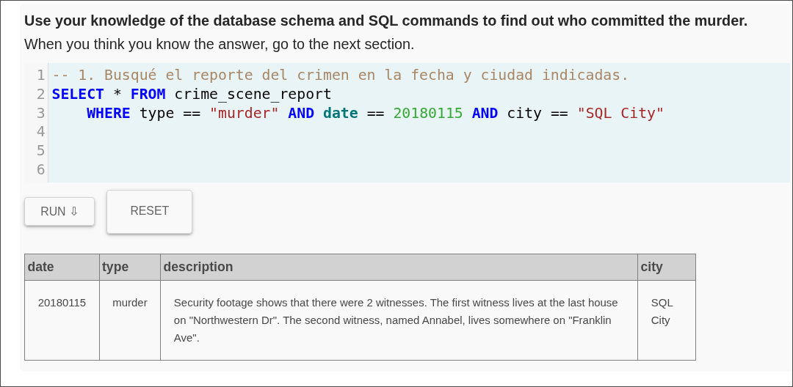
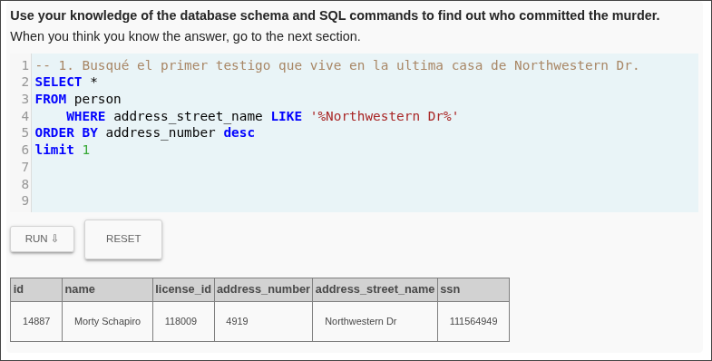
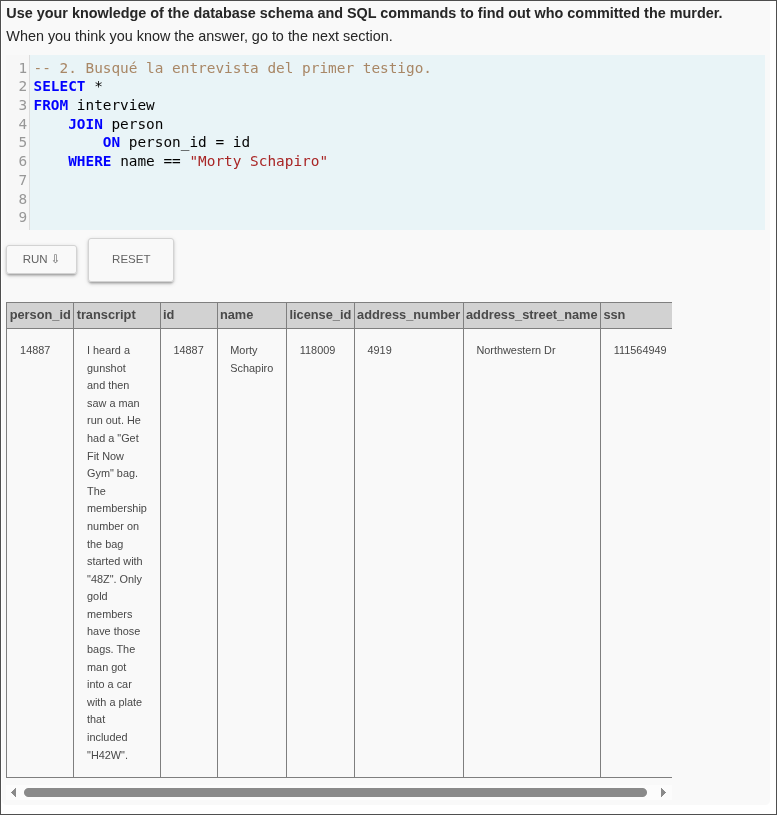
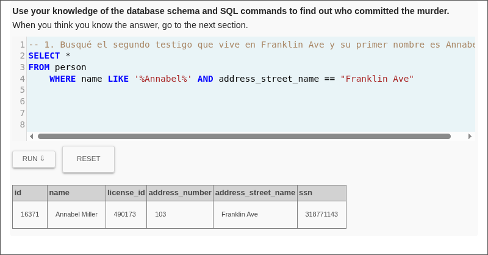
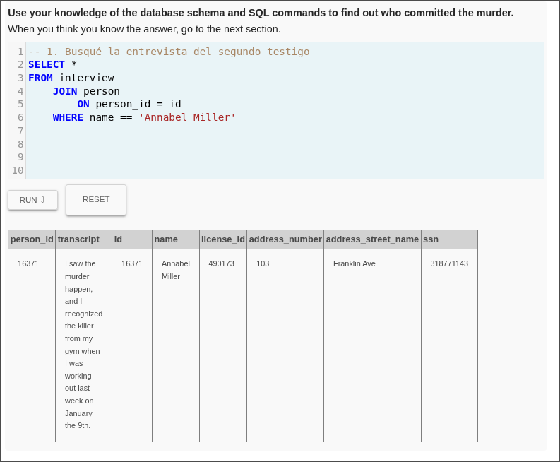
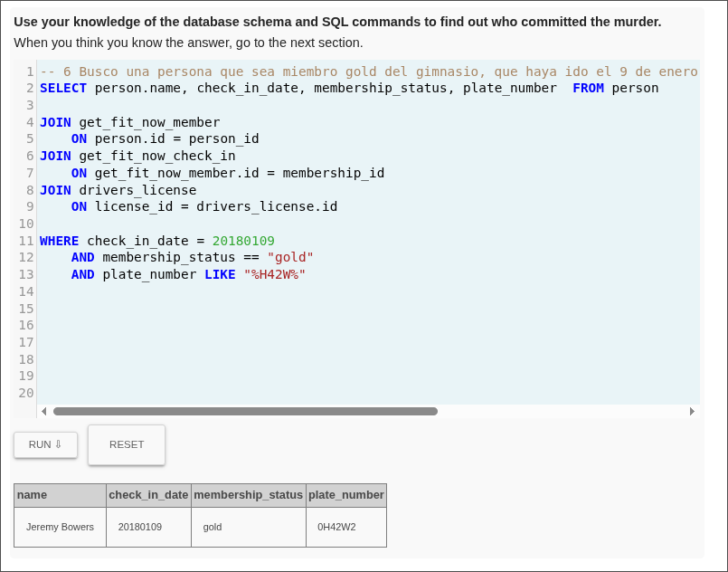
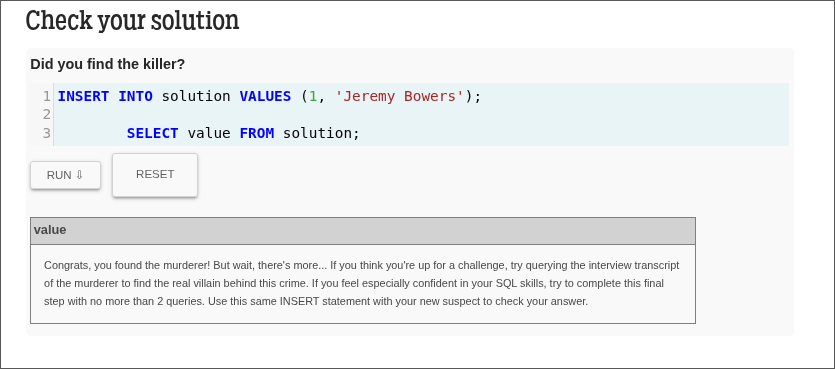
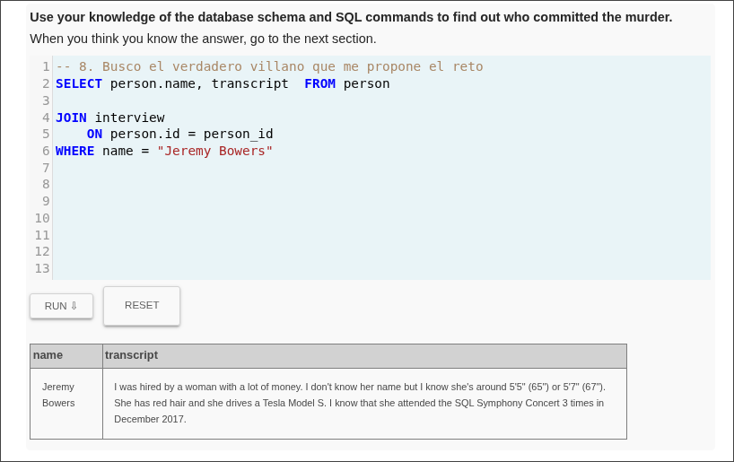
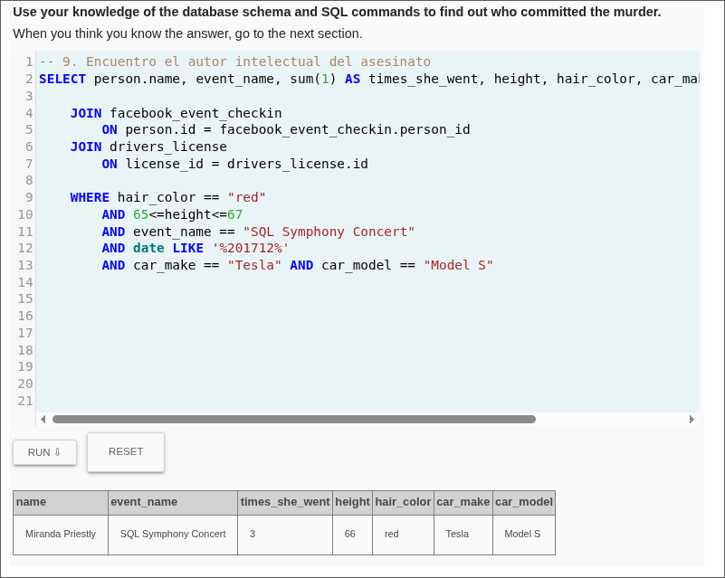
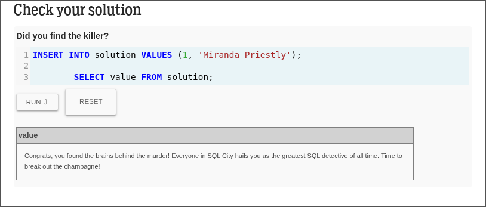

# **Misterio del asesinato SQL**
## Detective: Julian Esteban Hurtado Serna
---
# Resumen:
Un crimen ha sucedido y se ha necesitado de mi colaboración.  Fue un asesinato que ocurrió en algún momento del 15 de enero de 2018 y que tuvo lugar en SQL City. Comienzo recuperando el informe de la escena del crimen correspondiente de la base de datos del departamento de policía y tras investigar dos testigos presentes en el lugar del crimen encuentro el nombre del asesino: ***Jeremy Bowers***.

Posteriormente tras analizar la entrevista del asesino encuentro ciertas pistas sobre el autor intelectual del crimen. Estas pistas cohincide irrefutablemente con la señora ***Miranda Priestly***.

---
# Bitácora de Investigación:
## 1.
```sql 
SELECT * FROM crime_scene_report
	WHERE 
        type == "murder" 
        AND date == 20180115 
        AND city == "SQL City";
```
Busqué el reporte del crimen en la fecha y ciudad indicadas. Descubrí que hay dos testigos que me pueden dar informacion valiosa sobre el asesino:
Uno vive en **Northwestern Dr** y la otra es una mujer de nombre ***Annabel*** que vive en **Franklin Ave**.


## 2.
```sql
SELECT *
FROM person
	WHERE address_street_name LIKE '%Northwestern Dr%'
ORDER BY address_number desc
limit 1;
```
Me pongo en la tarea de encontrar el nombre del primer testigo. Para eso utilizo la pista que me dieron sobre este, el cual vive en la ultima propiedad de la calle **Northwestern Dr** es decir, la propiedad con el número de dirección más alto. 
Descubrí que el nombre del primer testigo es: ***Morty Schapiro***


## 3.
```sql
SELECT *
FROM interview
	JOIN person
		ON person_id = id
	WHERE name == "Morty Schapiro";
```
Ya teniendo el nombre del primer testigo busco su testimonio sobre el crimen. Tras hacer la consulta a la base de datos me doy cuenta que el testigo escuchó un disparo en el gimnasio y luego vio salir a un hombre corriendo el cual tenía un bolso exclusivo de una membresía Oro (Gold), posteriormente lo vió montarse a un carro del cual solo recuerda que la placa contenía las letras "H42W".



## 4.
```sql
SELECT *
FROM person
	WHERE name LIKE '%Annabel%' AND address_street_name == "Franklin Ave";
```
Ahora intento encontrar el nombre completo del segundo testigo teniendo encuenta que su primer nombre es ***Annabel***  y vive en **Franklin Ave**.

Los resultados de la consulta me arrojan el siguiente nombre: ***Annabel Miller***.



## 5.
```sql
SELECT *
FROM interview
	JOIN person
		ON person_id = id
	WHERE name == 'Annabel Miller';
```
Tras conocer el nombre completo del segundo testigo revicé su entrevista sobre el crimen para encontrar más pistas sobre el asesinato.

Encuentro que ***Annabel*** estuvo presente en el lugar del crimen (el gimnasio donde entrenaba) el día 9 de enero (2018) donde reconoció el hombre responsable del asesinato.



## 6. 
```sql
SELECT person.name, check_in_date, membership_status, plate_number  FROM person

JOIN get_fit_now_member
	ON person.id = person_id
JOIN get_fit_now_check_in
	ON get_fit_now_member.id = membership_id
JOIN drivers_license
	ON license_id = drivers_license.id
	
WHERE check_in_date = 20180109
	AND membership_status == "gold"
	AND plate_number LIKE "%H42W%";
```

Con todas las pistas proporcionadas por los dos testigos intento encontrar el nombre del hombre que cumple con estas tres condiciones:
- Entró al gimnasio el dia 9 de enero del 2018
- Tenía una membresía Gold.
- Tenía un automovil el cual su placa contenia las letras "%H42W%".

Tras la consulta, dí un un único nombre que cumplía perfectamente con las condiciones y al cual apuntaban todas las pistas: ***Jeremy Bowers***



## 7. 
```sql
INSERT INTO solution VALUES (1, 'Jeremy Bowers');
        
    SELECT value FROM solution;
```

Ahora verifico que la solución sea la correcta. El resultado me indica que el nombre del asesino SÍ es ***Jeremy Bowers*** sin embargo este no es el autor intelectual y me reta a encontrarlo.



## 8.
```sql
SELECT person.name, transcript  FROM person

JOIN interview
	ON person.id = person_id
WHERE name = "Jeremy Bowers";
```

Para encontrar el autor intelectual busco la entrevista del asesino para encontrar pistas sobre quien lo contrató para el asesinato.
Encontré que el asesino proporcionó datos muy específicos sobre una mujer que lo contrató:
- Tenía mucho dinero.
- Su altura era de 65 a 67 pulgadas aprox.
- Su pelo era de color rojo.
- Tenia un automovil **Tesla Modelo S**.
- Había asistido 3 veces al concierto **SQL Symphony** en el mes de diciembre del año 2017.



## 9.
```sql
SELECT person.name, event_name, sum(1) AS times_she_went, height, hair_color, car_make, car_model  FROM person

	JOIN facebook_event_checkin
		ON person.id = facebook_event_checkin.person_id
	JOIN drivers_license
		ON license_id = drivers_license.id

	WHERE hair_color == "red"
		AND 65<=height<=67
		AND event_name == "SQL Symphony Concert"
		AND date LIKE '%201712%'
		AND car_make == "Tesla" AND car_model == "Model S";
```
Tras buscar el nombre de una mujer que cumpliera todas estas condiciones encontré un único nombre al cual apuntaban todas las pistas: ***Miranda Priestly***.



## 10.
```sql
INSERT INTO solution VALUES (1, 'Miranda Priestly');
        
        SELECT value FROM solution;
```
Verifico que si sea ella la autora intelectual del asesinato y efectivamente es ***Miranda Priestly***


